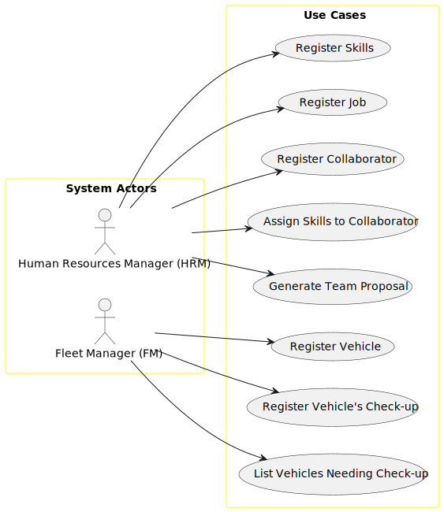

# Use Case Diagram (UCD)

# Use Cases

| UC/US | Description                                                                         |                   
|:------|:------------------------------------------------------------------------------------|
| US001 | [Register Skills](../../us001/01.requirements-engineering/Readme.md)                |
| US002 | [Register Job](../../us002/01.requirements-engineering/Readme.md)                   |
| US003 | [Register Collaborator](../../us003/01.requirements-engineering/Readme.md)          |
| US004 | [Assign Skills to Collaborator](../../us004/01.requirements-engineering/Readme.md)  |
| US005 | [Generate Team Proposal](../../us005/01.requirements-engineering/Readme.md)         |
| US006 | [Register Vehicle](../../us006/01.requirements-engineering/Readme.md)               |
| US007 | [Register Vehicle's Check-up](../../us007/01.requirements-engineering/Readme.md)    |
| US008 | [List Vehicles Needing Check-up](../../us008/01.requirements-engineering/Readme.md) |
