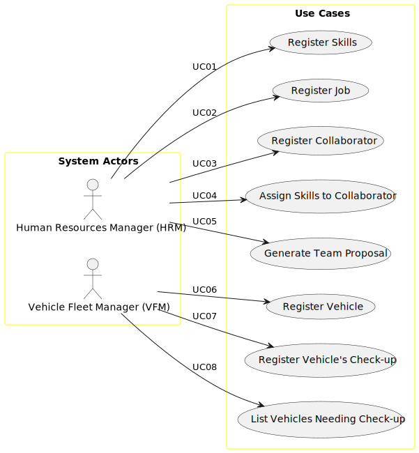

# Use Case Diagram (UCD)

# Use Cases / User Stories

| UC/US | Description                                                                           |                   
|:------|:--------------------------------------------------------------------------------------|
| US001 | [Register Skills](docs/sprintA/us001/01.requirements-engineering/Readme.md)           |
| US002 | [Register Job](sprintA\us002\01.requirements-engineering\Readme.md)                   |
| US003 | [Register Collaborator](sprintA\us003\01.requirements-engineering\Readme.md)          |
| US004 | [Assign Skills to Collaborator](sprintA\us004\01.requirements-engineering\Readme.md)  |
| US005 | [Generate Team Proposal](sprintA\us005\01.requirements-engineering\Readme.md)         |
| US006 | [Register Vehicle](sprintA\us006\01.requirements-engineering\Readme.md)               |
| US007 | [Register Vehicle's Check-up](sprintA\us007\01.requirements-engineering\Readme.md)    |
| US008 | [List Vehicles Needing Check-up](sprintA\us008\01.requirements-engineering\Readme.md) |
