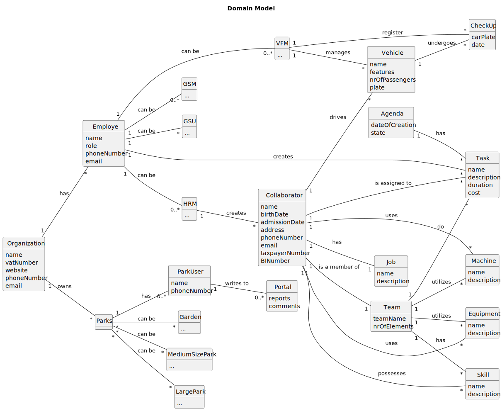

# OO Analysis

The construction process of the domain model is based on the client specifications, especially the nouns (for _concepts_) and verbs (for _relations_) used.

## Rationale to identify domain conceptual classes
To identify domain conceptual classes, start by making a list of candidate conceptual classes inspired by the list of categories suggested in the book "Applying UML and Patterns: An Introduction to Object-Oriented Analysis and Design and Iterative Development".

### _Conceptual Class Category List_

**Business Transactions**

* 

---

**Transaction Line Itemss**

* Task
*  Job

---

**Product/Service related to a Transaction or Transaction Line Item**

* 

---

**Transaction Records**

* Agenda 

---  

**Roles of People or Organizations**

* HRM
*  GSM
*  GSU
* VFM
* Employe
* Collaborator
* ParkUser

---

**Green Spaces**

* Garden
* MediumSizePark
 * LargePark
  * Parks

---

**Noteworthy Events**

* CheckUp

---

**Physical Objects**

* Vehicle
 * Machine
 * Equipment

---

**Descriptions of Things**

* Skill

---

**Catalogs**

* Team

---

**Containers**

* Portal

---

**Elements of Containers**

* Reports
 * Comments

---

**Organizations**

* Organization

---

**Other External/Collaborating Systems**

* 

---

**Records of finance, work, contracts, legal matters**

* 

---

**Financial Instruments**

* 

---

**Documents mentioned/used to perform some work/**

* 

---

## Rationale to identify associations between conceptual classes

An association is a relationship between instances of objects that indicates a relevant connection and that is worth of remembering, or it is derivable from the List of Common Associations:

- **_A_** is physically or logically part of **_B_**
- **_A_** is physically or logically contained in/on **_B_**
- **_A_** is a description for **_B_**
- **_A_** known/logged/recorded/reported/captured in **_B_**
- **_A_** uses or manages or owns **_B_**
- **_A_** is related with a transaction (item) of **_B_**
- etc.

| Concept (A) 		 |  Association   	   |    Concept (B) |
|--------------|:------------------:|---------------:|
| Organization   	 |      has 		 	      |        Employe |
|    Organization 	 |    owns    		 	    |          Parks |
| Employe      |      creates       |           Task |
|    Employe		 |     can be   	     |            GSU |
|    Employe   |       can be       |            GSM |
|    Employe  	 |    can be 		 	     |            HRM |
|    Employe 	 |   can be    		 	   |            VFM |
| Collaborator            |        has         |            Job |
|   	Collaborator	 | is a member of   	 |           Team |
|  Collaborator |     possesses      |          Skill |
|   Collaborator  	 | is assigned to	 	  |           Task |
| Collaborator|   drives    		 	   |        Vehicle |
|  Collaborator          |        uses        |        Machine |
|  Collaborator     |        uses        |      Equipment |
| Team       	 |      has 		 	      |          Skill |
|   Team    	 |     do   		 	      |           Task |
|   Team            |      utilizes      |        Machine |
|   Team  	 |    utilizes   	    |      Equipment |
| Parks      	 |    can be 		 	     |         Garden |
|   Parks |   can be   		 	    | MediumSizePark |
|   Parks           |       can be       |      LargePark |
|   Parks      |        has         |       ParkUser |
| VFM              |      register      |        CheckUp |
|   VFM 	 |     manages  	     |        Vehicle |
| Vehicle    | undergoes  |        CheckUp |
| HRM      	 |    creates 		 	    |        Employe |
| Agenda   |    has   		 	     |            ... |
| ParkUser            |         writes to         |         Portal |

## Domain Model

**Do NOT forget to identify concept atributes too.**

**Insert below the Domain Model Diagram in a SVG format**

