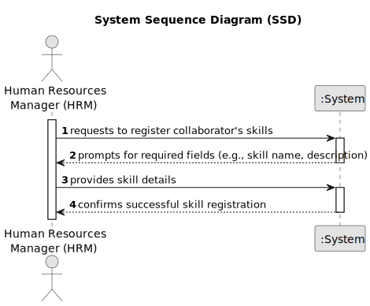

# US001 - As a Human Resources Manager (HRM), I want to register skills that a collaborator may have.

## 1. Requirements Engineering

### 1.1. User Story Description

User Story 1 focuses on optimizing the skill registration process within MusgoSublime (MS) for HR managers. This enhancement aims to streamline collaborator skill management, allowing HR managers to allocate tasks more effectively based on individual competencies. By improving this aspect of the system, MS can enhance project planning and execution efficiency, leading to increased productivity and resource utilization.

### 1.2. Customer Specifications and Clarifications 

**From the specifications document:**

>	**Data Required for Skill Registration:**
The document specifies that the human resources manager (HRM) wants to register skills that a collaborator may have. This indicates that the system needs to collect data related to the skills possessed by employees. 

>	**User Role:**
The user story specifies the role of the Human Resources Manager (HRM) as the primary user who will be interacting with the system to register skills.

> **Skill Registration Process:**
The user story implies that there should be a process in place for the HRM to register skills. This process may involve selecting an employee, specifying their skills, and saving the information into the system.

> **Skills:**
>
>Driving vehicles of different types (e.g. light, or heavy)
>
>Operating machines such as backhoes or tractors
>
>  Tree pruning
>
> Application of agriculture phytopharmaceuticals

### 1.3. Acceptance Criteria

* **AC1:** The system must allow the HRM to register skills for a collaborator.
* **AC2:** Each skill entry must include a name and description.
* **AC3:** The system must ensure that skills are unique for each collaborator.
* **AC4:** The HRM should be able to view and modify the skills of each collaborator.
### 1.4. Found out Dependencies

* There are no Found ot Dependencies.

### 1.5 Input and Output Data

**Input Data:**

*Typed Data:*
- Skill details entered by the HRM:
  - Skill name
  - Description (optional)

*Selected Data:*
- None

**Output Data:**

*List of Existing Skills:*
- The system provides a list of skills already registered in the database, enabling the HRM to review existing skills before inputting new ones.

*(In)Success of the Operation:*
- Upon submitting skill details, the system confirms whether the operation was successful or unsuccessful, providing feedback to the HRM regarding the registration of skills for a collaborator.

### 1.6. System Sequence Diagram (SSD)

### 1.7 Other Relevant Remarks

* The created task stays in a "not published" state in order to distinguish from "published" tasks.