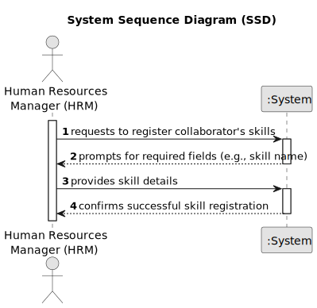

# US001 - Register skills

## 1. Requirements Engineering

### 1.1. User Story Description

As a Human Resources Manager (HRM), I want to register skills that a collaborator may have.

### 1.2. Customer Specifications and Clarifications 

**From the specifications document:**

>	**Data Required for Skill Registration:**
The document specifies that the human resources manager (HRM) wants to register skills that a collaborator may have. This indicates that the system needs to collect data related to the skills possessed by employees. 

>	**User Role:**
The user story specifies the role of the Human Resources Manager (HRM) as the primary user who will be interacting with the system to register skills.

> **Skill Registration Process:**
The user story implies that there should be a process in place for the HRM to register skills. This process may involve selecting an employee, specifying their skills, and saving the information into the system.

**From the client clarifications:**

> **Question:** Which information can be introduced to create a new skill?
>
> **Answer:** The skill name.

> **Question:** Which are the skills accepted? Or should we enable the HRM to introduce anything as a skill?
>
> **Answer:** All, it's up to HRM to decide. (special characters or algarisms should not be allowed in the skill name)

### 1.3. Acceptance Criteria

* **AC1:** The system must allow the HRM to register skills for a collaborator.
* **AC2:** Each skill entry must include a name.
* **AC3:** The HRM can edit the skills.

### 1.4. Found out Dependencies

* There are no Found ot Dependencies.

### 1.5 Input and Output Data

**Input Data:**

*Typed Data:*
- Skill details entered by the HRM:
  - Skill name

**Output Data:**

*List of Existing Skills:*
- The system provides a list of skills already registered in the database, enabling the HRM to review existing skills before inputting new ones.

*(In)Success of the Operation:*
- Upon submitting skill details, the system confirms whether the operation was successful or unsuccessful, providing feedback to the HRM regarding the registration of skills for a collaborator.

### 1.6. System Sequence Diagram (SSD)

### 1.7 Other Relevant Remarks

* The system should provide a mechanism for the HRM to review existing skills in the database before inputting new ones, facilitating consistency and avoiding duplicates.
* Design the user interface to be intuitive and user-friendly, enabling the HRM to easily navigate the skill registration process and perform actions efficiently.