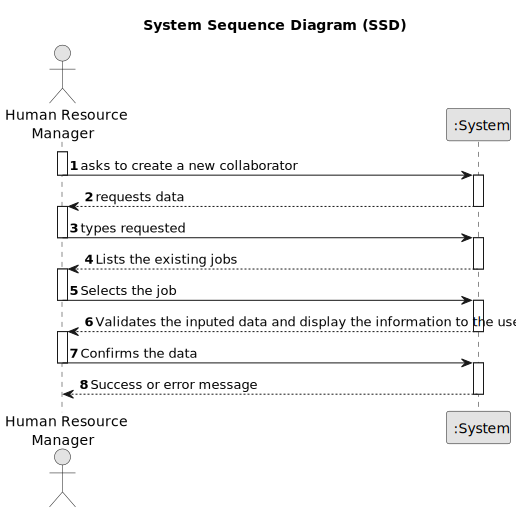

# US003 - Create a a collaborator with a job and fundamental characteristics.

## 1. Requirements Engineering

### 1.1. User Story Description

As an Human Resources Manager, I want to register a collaborator with a job and fundamental
characteristics.

### 1.2. Customer Specifications and Clarifications 

**From the specifications document:**

> There's no pertinent information about this US in the specifications document 

**From the client clarifications:**

> **Question:** Olá, cliente.
Na User Story 03 é mencionado o termo 'características fundamentais'. A minha questão é, precisamente, quais são estas características.
Cumprimentos,
Gustavo Lima, 1221349

> **Answer:** Bom dia,
os dados essenciais do colaborador mínimos serão nome, data de nascimento, data de admissão, morada, contacto (telefonico e email), documento de identificação e o seu número.
Podem considerar outros que entendam ser relevantes.
Cumprimentos,
Jorge

### 1.3. Acceptance Criteria

* **AC1:** If any required field is not filled in, the system should display a clear error message prompting the user to fill in the missing information before proceeding .
* **AC2:** The HRM should be able to register a collaborator with a job and fundamental characteristics.
* **AC3**  Upon successful registration, the system should display a confirmation message to the HRM indicating that the collaborator has been successfully registered.
* **AC4** When registering a collaborator, the system should validate that the job already exists(or a dropdown should open with the jobs created and the HRM chooses one).

### 1.4. Found out Dependencies

* There is a dependency on "US002 - Create a job" as there must be at least one job to associate the collaborator to it.

### 1.5 Input and Output Data

**Input Data:**

* Typed data:
    * name
    * birthdayDate 
    * admissionDate
    * address
    * phoneNumber
    * email
    * taxpayerNumber
    * BINumber
	
* Selected data:
    * a job

**Output Data:**

* List of existing jobs
* (In)Success of the operation

### 1.6. System Sequence Diagram (SSD)

