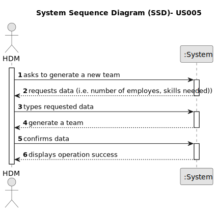

# US005 - Generate a Team

## 1. Requirements Engineering

### 1.1. User Story Description

As a HRM, I want to generate a team proposal automatically.

### 1.2. Customer Specifications and Clarifications 

**From the specifications document:**

>	Each task is characterized by having a unique reference per organization, a designation, an informal and a technical description, an estimated duration and cost, as well as a task category. 

>	As long as it is not published, access to the task is exclusive to the employees of the respective organization. 

**From the client clarifications:**

> **Question:** What are the input data to automatically generate a team?
>
> **Answer:** the max size of the team (for instance 4)
and the skill needed: 4 tree pruner and 1 light vehicle driver
meaning that one team member have 2 skills.

> **Question:** What should the output of the automation be? (should it just store the team proposal or show it to the customer?)  Will the team proposal be a document about all the instructions of each team member/worker?
>
> **Answer:** The systems provide team proposals and HRM can accept of refuse the proposals. In the future (not in this sprint) HRM may decide to edit the team.

### 1.3. Acceptance Criteria

* **AC1:**  All required fields must be filled in.
* **AC2:**  Task reference must have at least 5 alphanumeric chars.
* **AC3:**  When creating a task with an existing reference, the system must reject
  such operation.
* **AC4:**  The maximum team size and the set of skills need to be supplied by
  the HRM.
* **AC5:**  The intended skill set must be provided by the HRM.

### 1.4. Found out Dependencies

* US001, US003, US004.

### 1.5 Input and Output Data

**Input Data:**

* Typed data:
    * a reference: Unique identification for the team proposal.
    * a designation: Name or title of the team proposal.
    * an informal description:  A brief and non-technical description of the team's objective.
    * a technical description: A detailed description of the team's requirements and expectations.
    * an estimated duration: Expected time to complete the projects assigned to the team.
    * an estimated cost: Estimate of the financial resources required to form and maintain the team.
	
* Selected data:
    * a task category: Category or area of expertise to filter team members.

**Output Data:**

* List of existing 3 categories: - Lawn Mowing, Tree and Shrub Pruning, Cleanup and Debris Removal, Bed and Flower Maintenance, Equipment Maintenance, Pest and Disease Control, Installation and Maintenance of Irrigation Systems.
* (In)Success of the operation:  Clear indication of whether the automatic team proposal generation was completed successfully or not.

### 1.6. System Sequence Diagram (SSD)

**_Other alternatives might exist._**

#### Alternative One

#### Alternative Two

### 1.7 Other Relevant Remarks

* The created task stays in a "not published" state in order to distinguish from "published" tasks.