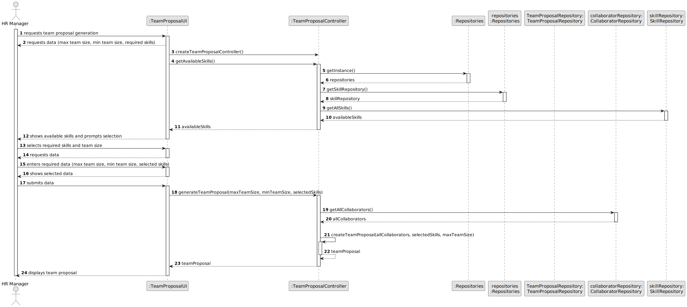
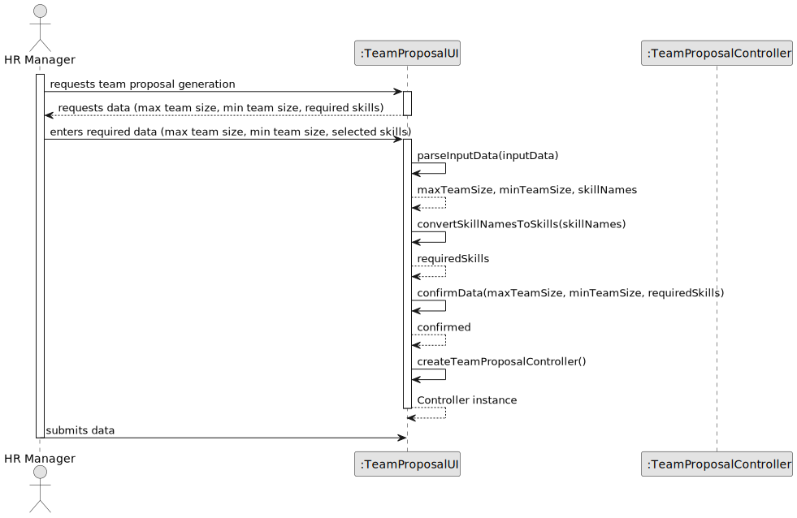
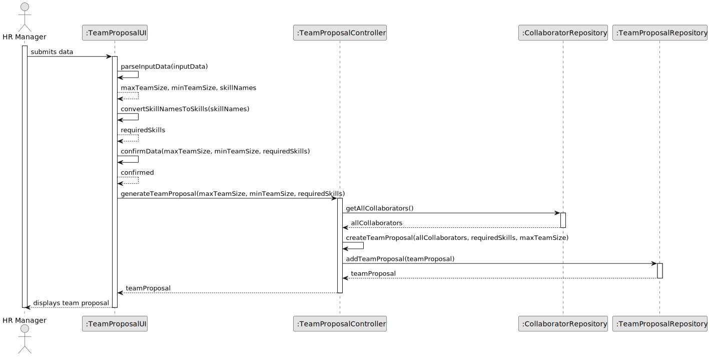
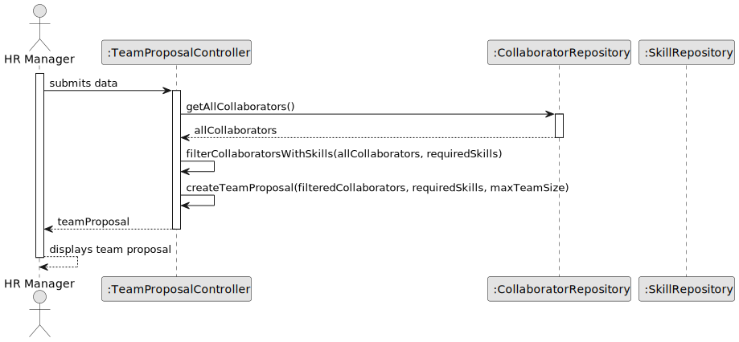
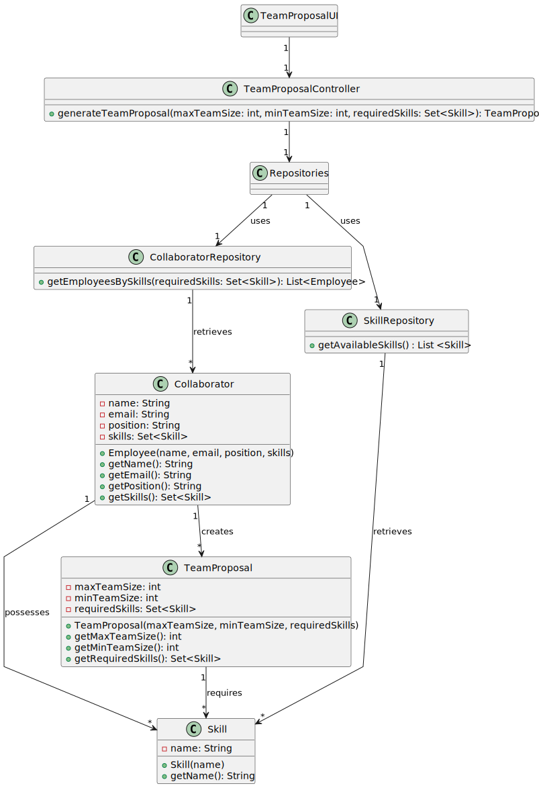

# US006 - Generate a Team

## 3. Design - User Story Realization 

### 3.1. Rationale 

_**Note that SSD - Alternative One is adopted.**_

| Interaction ID                                                                | Question: Which class is responsible for...                                     | Answer               | Justification (with patterns) |
|:------------------------------------------------------------------------------|:--------------------------------------------------------------------------------|:---------------------|:------------------------------|
| Step 1 : asks to create a new team                                            | ... interacting with the user?                                                  | TeamProposalUI       | Pure Fabrication              |
|                                                                          | ... coordinating the US?                                                        | TeamProposalController | Controller                    |
| Step 2 : requests data(team name, min team size, max team size, description  | ... displaying the UI for the user to input data?                               | TeamProposalUI         | Information Expert            |
| Step 3 : types requested data.                                                | ... keeping the inputted data?                                                  | TeamProposalUI         | Information Expert            |
| Step 4 : shows skill category list and asks to select one or more           | ...displaying the list of skills registered for the user to select one or more? | TeamProposalUI         | Information Expert            |
| Step 5 : selects one or more skill(s)                                       | ... temporarily keeping the selected data?                                      | TeamProposalUI         | Information Expert            |
| Step 6 : shows all data and requests confirmation.                            | ... displaying all information before submitting?                               | TeamProposalUI         | Information Expert            |    
|                                                                               | ... displaying the form for the user to confirm?                                | TeamProposalUI         | Information Expert            |
| Step 7 : confirms data.                                                       | ... generate a team proposal?                                                   | TeamProposalController | Pure Fabrication              |
|                                                                          | ... saving the team proposal?                                                   | TeamProposalUI         | Information Expert            | 
| Step 8 : shows team proposal and asks to confirm                            | ... displaying the team proposal before creating a team?                        | TeamProposalUI         | Information Experts           | 
| Step 9 : confirms team proposal.                                              | ... instantiating a new team?                                                   | TeamProposalRepository       | Pure Fabrication              |
|                                                                               | ... saving the team data?                                                       | TeamProposal                 | Information Expert            |
|                                                                               | ... validating the data locally (mandatory data)?                               | TeamProposal                 | Information Expert            |
|                                                                               | ... validating the data globally (duplicate data)?                              | TeamProposalRepository       | Information Expert            |
|                                                                               | ... saving the created team?                                                    | TeamProposalRepository       | Information Expert            |
| Step 10 : displays operation success.                                         | ... informing operation success?                                                | TeamProposalUI         | Information Expert            |

### Systematization

According to the taken rationale, the conceptual classes promoted to software classes are:

- `TeamProposal`
- `CollaboratorRepository`
- `TeamProposalRepository`

Other software classes (i.e., Pure Fabrication) identified:

- `CreateTeamProposalUI`
- `TeamProposalController`

This systematization aligns with the responsibilities and interactions required to fulfill User Story US05, focusing on the creation and management of team proposals by the HRM. The software classes identified represent key components responsible for handling user interactions, coordinating business logic, and accessing data from the system's domain model. Each class contributes to the overall functionality required to generate team proposals automatically based on specified criteria.

## 3.2. Sequence Diagram (SD)

_**Note that SSD - Alternative Two is adopted.**_

### Full Diagram

This diagram shows the full sequence of interactions between the classes involved in the realization of this user story.

### Split Diagrams

The following diagram shows the same sequence of interactions between the classes involved in the realization of this user story, but it is split in partial diagrams to better illustrate the interactions between the classes.

It uses Interaction Occurrence (a.k.a. Interaction Use).

**Requesting Data and Controller Creation**

**Generating Team Proposal and Storing in Repository**

**Retrieving Collaborators and Creating Team Proposal**

## 3.3. Class Diagram (CD)

