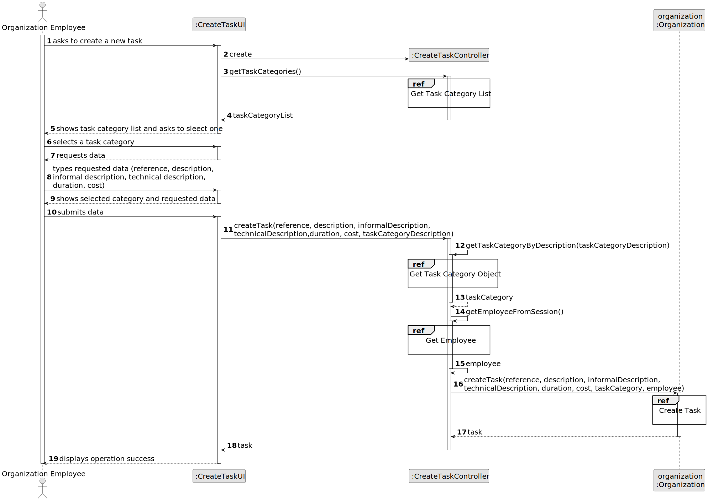

# US006 - Create a Task 

## 3. Design - User Story Realization 

### 3.1. Rationale 

_**Note that SSD - Alternative One is adopted.**_

| Interaction ID | Question: Which class is responsible for... | Answer               | Justification (with patterns)                                                                                 |
|:--------------|:------------------------------------------|:---------------------|:--------------------------------------------------------------------------------------------------------------|
| Step 1        | ... interacting with the HRM?              | CreateTeamProposalUI | Pure Fabrication: there is no reason to assign this responsibility to any existing class in the Domain Model. |
|               | ... coordinating the US?                   | TeamProposalController | Controller                                                                                                    |
|               | ... instantiating a new TeamProposal?      | TeamProposal         | Creator (Rule 1): in the Domain Model, a TeamProposal represents the entity being created.                    |
|               | ... knowing the user using the system?      | UserSession          | IE: cf. Authentication and Authorization (A&A) component documentation.                                      |
|               | ... accessing employee data?                | EmployeeRepository   | IE: Manages access to employee information based on required skills for the team proposal.                    |
|               | ... accessing team proposal data?           | TeamProposalRepository | IE: Manages persistence of team proposal data.                                                                 |
| Step 2        | ... displaying team size and required skills? | System              | IE: HRM specifies the maximum and minimum team size and required skills.                                       |
| Step 3        | ... saving the generated team proposal?     | TeamProposalRepository | IE: Persists the created team proposal object.                                                                 |
| Step 4        | ... validating inputted data?               | TeamProposal         | IE: Performs local validation on team size and required skills.                                               |
| Step 5        | ... informing operation success?            | CreateTeamProposalUI | IE: Responsible for user interactions and displaying operation success.                                        |

### Systematization

According to the taken rationale, the conceptual classes promoted to software classes are:

- `TeamProposal`
- `EmployeeRepository`
- `TeamProposalRepository`

Other software classes (i.e., Pure Fabrication) identified:

- `CreateTeamProposalUI`
- `TeamProposalController`

This systematization aligns with the responsibilities and interactions required to fulfill User Story US05, focusing on the creation and management of team proposals by the HRM. The software classes identified represent key components responsible for handling user interactions, coordinating business logic, and accessing data from the system's domain model. Each class contributes to the overall functionality required to generate team proposals automatically based on specified criteria.

## 3.2. Sequence Diagram (SD)

_**Note that SSD - Alternative Two is adopted.**_

### Full Diagram

This diagram shows the full sequence of interactions between the classes involved in the realization of this user story.

### Split Diagrams

The following diagram shows the same sequence of interactions between the classes involved in the realization of this user story, but it is split in partial diagrams to better illustrate the interactions between the classes.

It uses Interaction Occurrence (a.k.a. Interaction Use).

**Get Task Category List Partial SD**

**Get Task Category Object**

**Get Employee**

**Create Task**

## 3.3. Class Diagram (CD)

