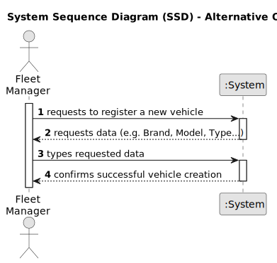

# US006 - Register a Vehicle 

## 1. Requirements Engineering

### 1.1. User Story Description

As a Fleet Manager (FM), I wish to register a vehicle including its details and maintenance schedule for efficient fleet management.
### 1.2. Customer Specifications and Clarifications 

**From the specifications document:**

> Each vehicle entry should include information such as Brand, Model, Type, Tare, Gross Weight, Current Km, Register Date, Acquisition Date, and Maintenance/Checkup Frequency (in Kms).

> Maintenance/check-up data should be recorded for each vehicle. 

> The frequency of maintenance/check-up should be specified in kilometers.

**From the client clarifications:**
> **Question:** Should the application identify a registered vehicle by a serial number or other attribute?
>
> **Answer:** By plate id.

> **Question:** For the application to work does the FM need to fill all the attributes of the vehicle?
>
> **Answer:** yes, besides the vehicle plate that by mistake doesn't appear on the text.

### 1.3. Acceptance Criteria

* **AC1:** All required fields must be filled in for vehicle registration.
* **AC2:** The vehicle registration form should allow the user to input essential details such as Brand, Model, Type, etc.
* **AC3:** The maintenance/check-up frequency field should only accept positive integer values representing kilometers.
* **AC4:** Upon successful registration, the system should confirm the addition of the vehicle.
* **AC5:** The maintenance/check-up schedule should be updated automatically based on the current mileage of the vehicle.

### 1.4. Found out Dependencies

* Found no dependencies

### 1.5 Input and Output Data

**Input Data:**

* Typed data:
    * Plate ID
    * Model 
    * Type
    * Tare
    * Gross Weight
    * Current Km
    * Register Date
    * Acquisition Date
    * Maintenance/Checkup Frequency (in Kms)
    * Last maintenance date
    * Next maintenance date
  
  
**Output Data:**

* Confirmation message upon successful registration.

### 1.6. System Sequence Diagram (SSD)

### 1.7 Other Relevant Remarks

* None