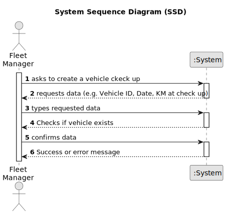

# US007 - Register a Vehicle's check up 

## 1. Requirements Engineering

### 1.1. User Story Description

As a Fleet Manager, I want to register a vehicle's check-up to keep track of its maintenance history and ensure its optimal performance.
### 1.2. Customer Specifications and Clarifications 

**From the client clarifications:**

> **Question:** What information is needed when registering a vehicle for check up?
>
> **Answer:** Vehicle ID,
Date,
current kms.

> **Question:** What is the unit of measurement used to estimate the check-up frequency (Kms, months, etc.)?
>
> **Answer:** In real context all could be considered, in the scope of this project just kms will be considered.

> **Question:** What are the validation requirements for the vehicle ID?
> 
> **Answer:** After 2020: AA-00-AA;
between 2005-2020 00-AA-00;
between 1992-2005 00-00-XX.

> **Question:** Can a vehicle have more than one check-up?
>
> **Answer:** Yes.

### 1.3. Acceptance Criteria

* **AC1:** All required fields must be filled in.
* **AC2:** The unit of measurement used to estimate the check up frequency must be expressed in KM.
* **AC3:** The validation requirements for the vehicle ID are: After 2020: AA-00-AA;
  between 2005-2020 00-AA-00;
  between 1992-2005 00-00-XX.

### 1.4. Found out Dependencies

* There is a dependency on "US006 - Register a Vehicle" as a vehicle must be registered first before being designed to a check up.

### 1.5 Input and Output Data

**Input Data:**

* Typed data:
    * Vehicle ID
    * Date
    * Current KM

**Output Data:**

* Confirmation message indicating successful registration or an error message if any validation fails.

### 1.6. System Sequence Diagram (SSD)

### 1.7 Other Relevant Remarks

* It wasn't clear if in the input data we should insert the current KM of the car or the Km on the checkup because the client responded to the same question in two different ways.