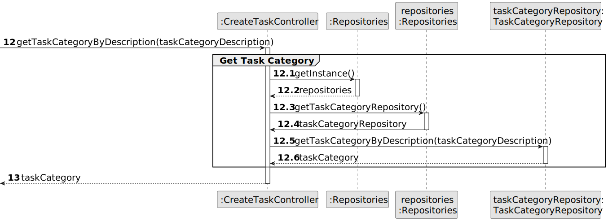

# US002 - Create a new job

## 3. Design - User Story Realization 

### 3.1. Rationale

| Interaction ID                                     | Question: Which class is responsible for...                    | Answer        | Justification (with patterns)                                                                                      |
|:---------------------------------------------------|:---------------------------------------------------------------|:--------------|:-------------------------------------------------------------------------------------------------------------------|
| Step 1  		                                         | 	... interacting with the actor?                               | CreateJobUI   | Pure Fabrication: there is no reason to assign this responsibility to any existing class in the Domain Model.      |
| Step 2 - Requests data  (jobName) 		               | 	... displaying the form for the actor to input the data						 | CreateJobUI   | IE: is responsible for user interactions.                                                                          |
| Step 3 - Types requested data (jobName)	           | 	... temporarily kepping the inputed data                      | CreateJobUI   | IE: is responsible for temporarily keeping the typed data until the actor confirmates it                           |
| Step 4 - Shows all data and requests confirmation	 | 	... displaying all information before submitting              | CreateJobUI   | IE: Temporarily shows inputed that until actor confirms it                                                         |
| Step 5 - Confirm data		                            | 	... new job?                                                  | JobRepository | IE:  Pure Fabrication: there is no reason to assign this responsibility to any existing class in the Domain Model. |
| 		                                                 | 			... saving the inputed data?				                            | Job           | IE: the created object has its own data                                                                            |              
| 		                                                 | 	... validating the data(mandatory data)                       | Job           | IE: owns its data.                                                                                                 | 
| 			  		                                            | 	... validating the data globally (checks for duplicate data)? | JobRepository | IE: knows all the data.                                                                                            | 
| 			  		                                            | 	... saving the created job?                                   | JobRepository | IE: owns all the jobs.                                                                                             | 
| Step 5 - Display operation sucess                  | 	... informing operation success?                              | CreateJobUI   | IE: is responsible for user interactions.                                                                          | 

### Systematization ##

According to the taken rationale, the conceptual classes promoted to software classes are: 

* Organization
* Task

Other software classes (i.e. Pure Fabrication) identified: 

* CreateTaskUI  
* CreateTaskController

## 3.2. Sequence Diagram (SD)

_**Note that SSD - Alternative Two is adopted.**_

### Full Diagram

This diagram shows the full sequence of interactions between the classes involved in the realization of this user story.

### Split Diagrams

The following diagram shows the same sequence of interactions between the classes involved in the realization of this user story, but it is split in partial diagrams to better illustrate the interactions between the classes.

It uses Interaction Occurrence (a.k.a. Interaction Use).

**Get Task Category List Partial SD**

**Get Task Category Object**

**Get Employee**

**Create Task**

## 3.3. Class Diagram (CD)

