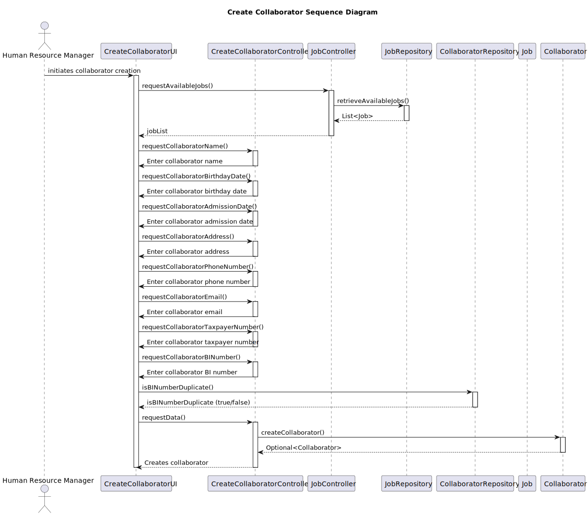
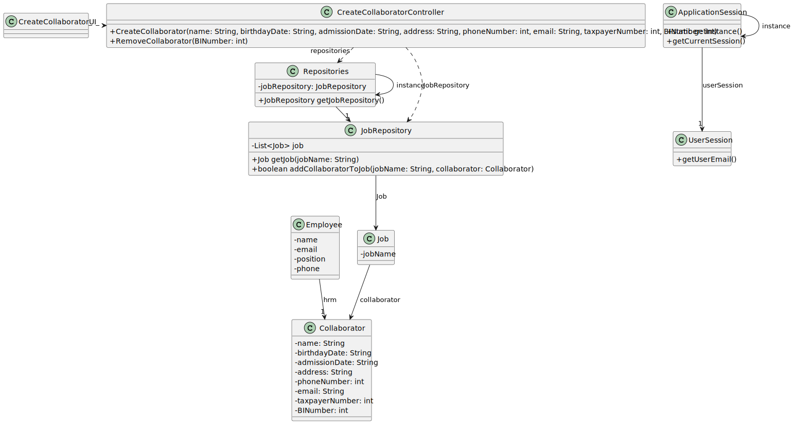

# US003 - Create a collaborator with a job

## 3. Design - User Story Realization 

### 3.1. Rationale

| Interaction ID | Question: Which class is responsible for... | Answer          | Justification (with patterns)                                                                                      |
|:-------------- |:---------------------------------------------|:----------------|:-------------------------------------------------------------------------------------------------------------------|
| Step 1         | ... interacting with the actor?              | CreateCollaboratorUI | Pure Fabrication: UI components typically handle interactions with actors.                                            |
|                | ... coordinating the US?                    | CreateCollaboratorController | Controller                                                                                                      |
|                | ... instantiating a new Collaborator?       | Collaborator    | Creator (Rule 1): The Collaborator class is responsible for representing and creating new collaborator instances. |
| Step 3         | ... saving the inputted data?               | Collaborator    | Information Expert: The Collaborator object holds the inputted data.                                                |
| Step 4         | ... retrieving the available job categories? | JobRepository | Controller: The JobRepository retrieves job categories from the data layer.                                         |
|                | ... displaying the job categories?          | CreateCollaboratorUI | View: The UI component displays the available job categories to the user.                                           |
| Step 5         | ... validating the selected job category?  | JobRepository   | Controller: The JobRepository validates the selected job category.                                                 |
| Step 6         | ... informing operation success?            | CreateCollaboratorUI | Controller: The UI component informs the user about the success of the operation.                                    |
| Step 7         | ... validating the collaborator data?       | Collaborator    | Information Expert: The Collaborator class performs validation on its own data.                                      |
|                | ... validating the BI number?               | CollaboratorRepository | Controller: The CollaboratorRepository validates the uniqueness of the BI number.                                    |
| Step 8         | ... informing operation success?            | CreateCollaboratorUI | Controller: The UI component informs the user about the success of the operation.                                    |

### Systematization ##

According to the taken rationale, the conceptual classes promoted to software classes are: 

* CreateCollaboratorUI
* CreateCollaboratorController

Other software classes (i.e. Pure Fabrication) identified: 

* Collaborator
* UserSession
* JobRepository

## 3.2. Sequence Diagram (SD)

_**Note that SSD - Alternative Two is adopted.**_

### Full Diagram

This diagram shows the full sequence of interactions between the classes involved in the realization of this user story.

## 3.3. Class Diagram (CD)

