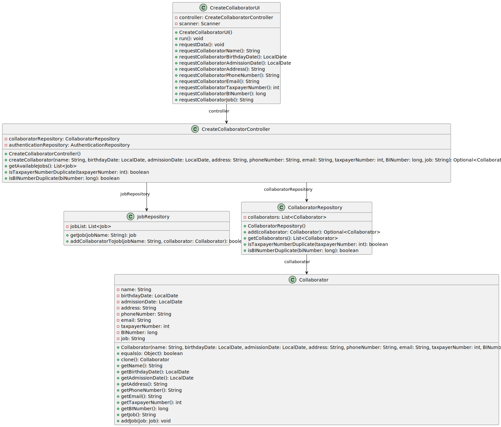

# US003 - Create a collaborator with a job

## 3. Design - User Story Realization 

### 3.1. Rationale

| Interaction ID | Question: Which class is responsible for... | Answer          | Justification (with patterns)                                                                                      |
|:-------------- |:---------------------------------------------|:----------------|:-------------------------------------------------------------------------------------------------------------------|
| Step 1         | ... interacting with the actor?              | CreateCollaboratorUI | Pure Fabrication: UI components typically handle interactions with actors.                                            |
|                | ... coordinating the US?                    | CreateCollaboratorController | Controller                                                                                                      |
|                | ... instantiating a new Collaborator?       | Collaborator    | Creator (Rule 1): The Collaborator class is responsible for representing and creating new collaborator instances. |
|                | ... knowing the user using the system?      | UserSession     | Information Expert: The UserSession class encapsulates user-related information, such as email.                   |
|                |                                               | Employee        | Information Expert: The Employee class holds details about employees, including their email.                       |
| Step 3         | ... saving the inputted data?               | Collaborator    | Information Expert: The Collaborator object holds the inputted data.                                                |
| Step 4         | ... knowing the job categories to show?     | System          | Creator (Rule 1): The System is responsible for defining and managing task categories.                             |
| Step 5         | ... saving the selected category?           | JobRepository   | Controller: The JobRepository interacts with the data layer to save the selected category for the job.             |
| Step 7         | ... validating all data (local validation)?| Collaborator    | Information Expert: The Collaborator class performs validation on its own data.                                      |
|                | ... validating all data (global validation)?| JobRepository | Controller: The JobRepository may perform global validation on the job before saving it.                             |
|                | ... saving the created job?                 | JobRepository   | Controller: The JobRepository handles the persistence of job data.                                                  |
| Step 8         | ... informing operation success?            | CreateCollaboratorUI | Controller: The UI component is responsible for displaying operation success to the user.                            |

### Systematization ##

According to the taken rationale, the conceptual classes promoted to software classes are: 

* CreateCollaboratorUI
* CreateCollaboratorController

Other software classes (i.e. Pure Fabrication) identified: 

* Collaborator
* UserSession
* JobRepository

## 3.2. Sequence Diagram (SD)

_**Note that SSD - Alternative Two is adopted.**_

### Full Diagram

This diagram shows the full sequence of interactions between the classes involved in the realization of this user story.

## 3.3. Class Diagram (CD)

