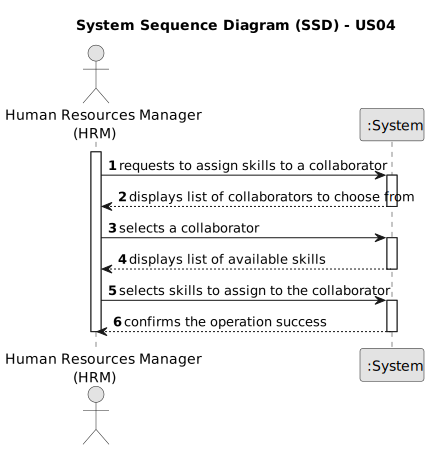

# US004 - **Assign skills to a collaborator:** 

## 1. Requirements Engineering

### 1.1. User Story Description

As an HRM, I want to assign one or more skills to a collaborator.

### 1.2. Customer Specifications and Clarifications 

**From the specifications document:**

> There's no pertinent information about this US in the specifications document

**From the client clarifications:**

> **Question:** There is a minimum and maximum number of skills?
>
> **Answer:** No.

### 1.3. Acceptance Criteria

* **AC1:** The system should allow the Human Resources Manager (HRM) to assign one or more skills to a collaborator.
* **AC2:** The system should provide a list of available skills for selection when assigning skills to a collaborator.
* **AC3:** After selecting the skills, the system should confirm the assignment and update the collaborator's profile accordingly.
* **AC4:** If the selected skill is not available or does not exist in the system, the HRM should be notified with an appropriate error message.
### 1.4. Found out Dependencies

* The dependencies for US04 include US01 and US03. US01 involves registering skills that a collaborator may have, while US03 focuses on registering the collaborator. These dependencies are crucial for effectively assigning skills to collaborators within the organization's workforce management system.

### 1.5 Input and Output Data

**Input Data:**

*Typed Data:*
- none

*Selected Data:*
- Skills to be assigned to the collaborator
- Collaborator details selected by the HRM:
  - Collaborator name

**Output Data:**

*List of Skills:*
- The system provides a list of available skills to be assigned to the selected collaborator, allowing the HRM to choose from existing skills.

*(In)Success of the Operation:*
- Upon submitting the selected skills for the collaborator, the system confirms whether the operation was successful or unsuccessful, providing feedback to the HRM regarding the assignment of skills to the collaborator.

### 1.6. System Sequence Diagram (SSD)

### 1.7 Other Relevant Remarks

* Implement data integrity measures to prevent duplicate or erroneous skill assignments.