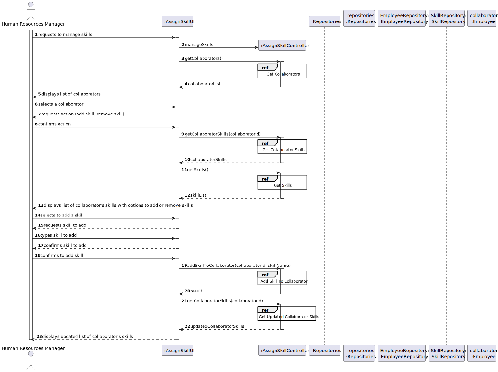
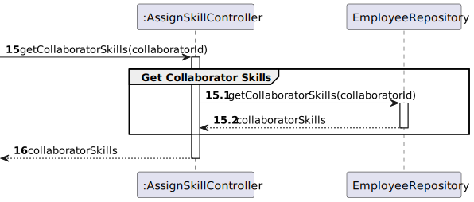

## US004- Assign Skills to a Colaborator3. Design - User Story Realization

## 3. Design - User Story Realization

### 3.1. Rationale

**The rationale grounds on the SSD interactions and the identified input/output data.**

### 3.1. Rationale

| Interaction ID | Question: Which class is responsible for...      | Answer                                | Justification (with patterns)                       |
| :------------- | :----------------------------------------------- | :------------------------------------ | :-------------------------------------------------- |
| Step 1         | Interacting with the HRM?                        | RegisterSkillToCollaboratorUI         | UI, interacts with user.                            |
| Step 2         | Knowing all skills in the system?                | SkillRepository                       | Pure Fabrication, IE.                               |
| Step 2         | Knowing all collaborators in the system          | EmployeeRepository                    | Pure Fabrication, IE.                               |
| Step 3         | Interacting with the provided collaborator id    | RegisterSkillToCollaboratorController | Controller, mediates input from user to the system. |
| Step 4         | Showing available skills to the HRM              | RegisterSkillToCollaboratorUI         | UI, interacts with user.                            |
| Step 5         | Registering the skill                            | Collaborator                          | IE, has its own skills.                            |
| Step 6         | Show HRM the collaborator and registered skills | RegisterSkillUI                       | UI, interacts with user.                            |

### Systematization

According to the taken rationale, the conceptual classes promoted to software classes are:

* Collaborator [Employee]
* Skill

Other software classes (i.e. Pure Fabrication) identified:

* AssignSkillController
* SkillAssignment
* SkillAssignmentRepository.java
* CollaboratorRepository
* SkillRepository
* AssignSkillUI

## 3.2. Sequence Diagram (SD)

his diagram shows the full sequence of interactions between the classes involved in the realization of this user story.

### Split Diagrams

The following diagram shows the same sequence of interactions between the classes involved in the realization of this user story, but it is split in partial diagrams to better illustrate the interactions between the classes.

It uses Interaction Occurrence (a.k.a. Interaction Use).

**Split Diagram**

**Add SKill to a Collaborator**

**Get Collaborator Skills**

**Get Collaboratores**

**Get SKills**

**Remove SKills**

## 3.3. Class Diagram (CD)

