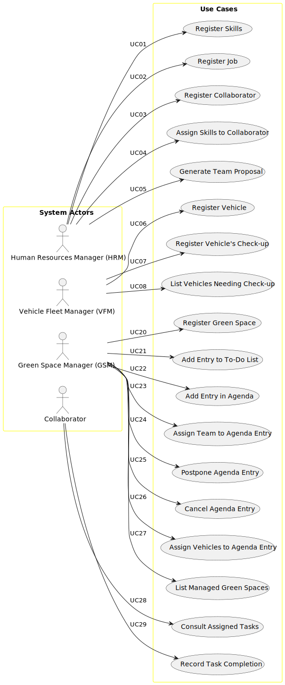

# Use Case Diagram (UCD)

# Use Cases

| UC/US | Description                                                                         |                   
|:------|:------------------------------------------------------------------------------------|
| US001 | [Register Skills](../../us001/01.requirements-engineering/Readme.md)                |
| US002 | [Register Job](../../us002/01.requirements-engineering/Readme.md)                   |
| US003 | [Register Collaborator](../../us003/01.requirements-engineering/Readme.md)          |
| US004 | [Assign Skills to Collaborator](../../us004/01.requirements-engineering/Readme.md)  |
| US005 | [Generate Team Proposal](../../us005/01.requirements-engineering/Readme.md)         |
| US006 | [Register Vehicle](../../us006/01.requirements-engineering/Readme.md)               |
| US007 | [Register Vehicle's Check-up](../../us007/01.requirements-engineering/Readme.md)    |
| US008 | [List Vehicles Needing Check-up](../../us008/01.requirements-engineering/Readme.md) |
| US020 | [Register Green Space](../../us020/01.requirements-engineering/Readme.md)           |
| US021 | [Add Entry to To-Do List](../../us021/01.requirements-engineering/Readme.md)        |
| US022 | [Add Entry in Agenda](../../us022/01.requirements-engineering/Readme.md)            |
| US023 | [Assign Team to Agenda Entry](../../us023/01.requirements-engineering/Readme.md)    |
| US024 | [Postpone Agenda Entry](../../us024/01.requirements-engineering/Readme.md)          |
| US025 | [Cancel Agenda Entry](../../us025/01.requirements-engineering/Readme.md)             |
| US026 | [Assign Vehicles to Agenda Entry](../../us026/01.requirements-engineering/Readme.md) |
| US027 | [List Managed Green Spaces](../../us027/01.requirements-engineering/Readme.md)       |
| US028 | [Consult Assigned Tasks](../../us028/01.requirements-engineering/Readme.md)          |
| US029 | [Record Task Completion](../../us029/01.requirements-engineering/Readme.md)          |
