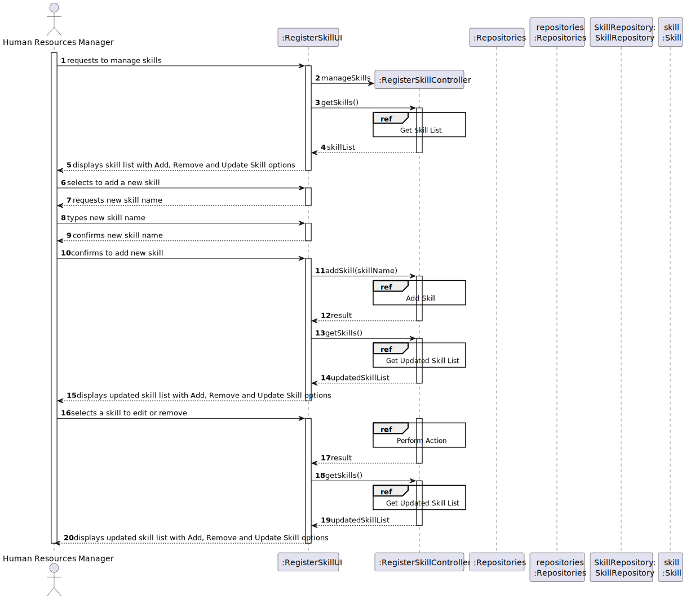
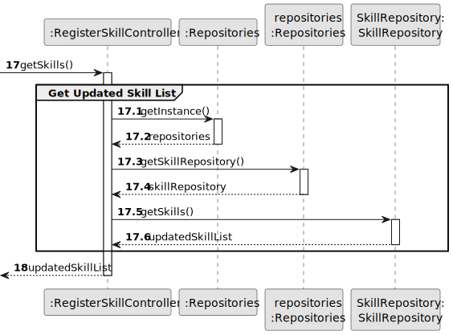

# US001 - Register a Skill 

## 3. Design - User Story Realization 

### 3.1. Rationale

**Rationale for User Story 1:**

**Rationale for User Story 1:**

| Interaction ID | Question: Which class is responsible for... | Answer               | Justification (with patterns)                                                                                 |
|:-------------  |:--------------------- |:---------------------|:--------------------------------------------------------------------------------------------------------------|
| Step 1  		 |	... interacting with the actor? | RegisterSkillUI      | Pure Fabrication: `RegisterSkillUI` is a UI component responsible for interacting with the user. There is no reason to assign this responsibility to any existing class in the Domain Model. |
| 			  		 |	... coordinating the US? | RegisterSkillController | Controller: `RegisterSkillController` coordinates the use case by handling user inputs, invoking necessary operations, and updating the UI.                                                                                                    |
| 			  		 |	... instantiating a new Skill? | SkillRepository     | Creator (Rule 1): `SkillRepository` is responsible for managing Skills in the Domain Model, making it suitable for creating new instances of Skill objects.                                |
| 			  		 | ... knowing the user using the system?  | UserSession          | Information Expert: `UserSession` manages user sessions and authentication, making it the expert in knowing the user using the system. Infrastructure Entity: It's an infrastructure component.                                              |
| 			  		 |							 | SkillRepository      | Information Expert: `SkillRepository` is responsible for managing skills and their persistence, making it the expert in the domain of skills.                                                           |
| Step 3  		 |	... saving the inputted skill? | SkillRepository     | High Cohesion, Low Coupling: `SkillRepository` is responsible for managing the storage and retrieval of skills, demonstrating high cohesion by focusing on a single responsibility. It also exhibits low coupling by encapsulating its own logic and data, reducing dependencies on other classes.                                                          |
| Step 4  		 |	... retrieving the list of skills to display? | SkillRepository     | High Cohesion, Low Coupling: `SkillRepository` provides access to the list of skills, showing high cohesion by focusing on skill management. Its low coupling ensures that changes in how skills are retrieved do not affect other parts of the system.                                                                |
| Step 5  		 |	... removing the selected skill? | SkillRepository     | High Cohesion, Low Coupling: `SkillRepository` is responsible for deleting skills from the repository, demonstrating high cohesion by grouping related operations. Its low coupling ensures that changes in how skills are removed do not impact other components.                                                  |
| Step 7  		 |	... validating the new skill (format validation)? | SkillRepository     | High Cohesion, Low Coupling: `SkillRepository` validates the format of the skill name according to business rules, showcasing high cohesion by focusing on a specific validation task. Its low coupling ensures that validation logic is encapsulated within the repository, minimizing dependencies on external components.                                    | 
| 			  		 |	... validating the new skill (uniqueness validation)? | SkillRepository     | High Cohesion, Low Coupling: `SkillRepository` ensures that the skill name is unique within the repository, demonstrating high cohesion by handling a related validation concern. Its low coupling ensures that uniqueness validation is encapsulated within the repository, reducing dependencies on external modules.                                           | 
| 			  		 |	... saving the new skill? | SkillRepository     | High Cohesion, Low Coupling: `SkillRepository` adds the new skill to the repository, showcasing high cohesion by grouping related persistence operations. Its low coupling ensures that the saving process is encapsulated within the repository, minimizing dependencies on external components.                                                               | 
| Step 8  		 |	... informing operation success?| RegisterSkillUI      | High Cohesion, Low Coupling: `RegisterSkillUI` is responsible for providing feedback to the user, demonstrating high cohesion by handling user interactions and feedback. Its low coupling ensures that changes in the UI do not affect other parts of the system.                                                | 

### Systematization ##

According to the taken rationale, the conceptual classes promoted to software classes are: 

* Skill

Other software classes (i.e. Pure Fabrication) identified: 

* RegisterSkillUI
* RegisterSkillController

## 3.2. Sequence Diagram (SD)

### Full Diagram

This diagram shows the full sequence of interactions between the classes involved in the realization of this user story.

### Split Diagrams

The following diagram shows the same sequence of interactions between the classes involved in the realization of this user story, but it is split in partial diagrams to better illustrate the interactions between the classes.

It uses Interaction Occurrence (a.k.a. Interaction Use).

**Add Skill**

**Get Skill List**

**Get Updated Skill List**

**Diagram Performaction**

## 3.3. Class Diagram (CD)

