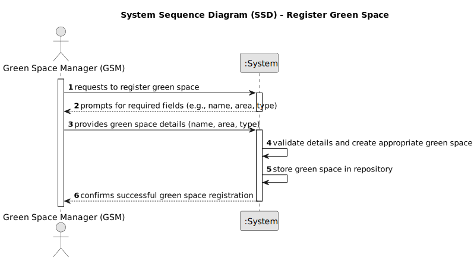

# US020 - Register a Green Space 

## 1. Requirements Engineering

### 1.1. User Story Description

As a Green Space Manager (GSM), I want to register a green
space (garden, medium-sized park or large-sized park) and its respective
area.

### 1.2. Customer Specifications and Clarifications 
**From the specifications document:**
>### Types of Green Spaces and Their Equipment
>
>**Garden:**
>- Space with or without trees.
>- Minimal or no equipment.
>- May have a basic irrigation system and/or benches.
>
>**Medium-sized park:**
>- Green space with a few hundred or thousands of square meters.
>- Wooded garden area.
>- Includes infrastructures such as toilets, drinking fountains, irrigation system, lighting, and children's playground.
>- Examples: Quinta do Covelo, Jardim d’Arca de Água.
>
>**Large-sized park:**
>- Multi-functional space with diverse garden spaces and woods.
>- Includes varied equipment and services.
>- Examples: Parque da Cidade.

### 1.3. Acceptance Criteria

* **AC1:** As a Green Space Manager (GSM), I should be able to register a green space (garden, medium-sized park, or large-sized park) by providing its name, area, and type so that it is stored in the system for future management and reference.

### 1.4. Found out Dependencies

* There isn´t a dependencies on "US020 - Register a GreenSpace". 
* 
### 1.5 Input and Output Data

**Input Data:**

* Typed data:
  * Name of the green space.
  * Area of the green space in square meters.
* Selected data:
  * Type of green space (Garden, Medium-sized park, Large-sized park).

**Output Data:**

* Confirmation message of successful green space registration.
* List of all registered green spaces with details (name, area, type).

### 1.6. System Sequence Diagram (SSD)

### 1.7 Other Relevant Remarks

* The ability to list all registered green spaces, along with their details, is essential for effective management of green spaces.
* The system should provide appropriate feedback to the user after successful registration of a green space, ensuring a positive user experience.
* 