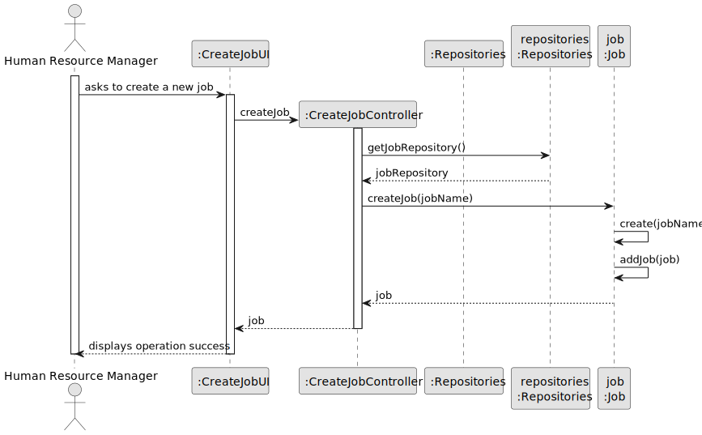
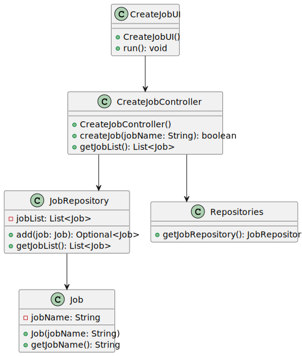

# US021 - Add a Entry to a to-do-List

## 3. Design - User Story Realization 

### 3.1. Rationale

| Interaction ID                                     | Question: Which class is responsible for...                    | Answer               | Justification (with patterns)                                                                                      |
|:---------------------------------------------------|:---------------------------------------------------------------|:---------------------|:-------------------------------------------------------------------------------------------------------------------|
| Step 1                                             | ...interacting with the actor?                                 | ToDoListUI           | Pure Fabrication: não há razão para atribuir essa responsabilidade a nenhuma classe existente no Domain Model.      |
| Step 2 - Requests data (taskDescription, urgency, expectedDuration, email) | ...solicitar os dados do utilizador?                           | ToDoListUI           | IE: responsável por interações com o usuário.                                                                       |
| Step 3 - Provides requested data (taskDescription, urgency, expectedDuration, email) | ...temporarily keeping the inputted data?                      | ToDoListUI           | IE: responsável por manter temporariamente os dados inseridos até que o ator os confirme.                           |
| Step 4 - Requests selection of a green space       | ...displaying the list of green spaces for selection?          | ToDoListUI           | IE: responsável por mostrar as informações antes da submissão.                                                      |
| Step 5 - Selects a green space                     | ...validating and processing the input data?                   | ToDoListController   | Controller: responsável por coordenar o processo de criação de entrada, interagindo com o UI e o repositório.        |
|                                                    | ...saving the new to-do list entry?                            | ToDoListRepository   | IE: responsável por armazenar todas as entradas da lista de tarefas.                                                |
| Step 6 - Display operation success                 | ...informing operation success?                                | ToDoListUI           | IE: responsável por interações com o usuário.                                                                       |

### Systematization

According to the taken rationale, the conceptual classes promoted to software classes are:

* `ToDoList`

Other software classes (i.e. Pure Fabrication) identified:

* `ToDoListUI`
* `ToDoListController`

## 3.2. Sequence Diagram (SD)

_**Note that SSD - Alternative Two is adopted.**_

### Full Diagram

This diagram shows the full sequence of interactions between the classes involved in the realization of this user story.

[//]: # (### Split Diagrams)

[//]: # ()
[//]: # (The following diagram shows the same sequence of interactions between the classes involved in the realization of this user story, but it is split in partial diagrams to better illustrate the interactions between the classes.)

[//]: # ()
[//]: # (It uses Interaction Occurrence &#40;a.k.a. Interaction Use&#41;.)

[//]: # ()
[//]: # (![Sequence Diagram - split]&#40;svg/us006-sequence-diagram-split.svg&#41;)

[//]: # ()
[//]: # (**Get Task Category List Partial SD**)

[//]: # ()
[//]: # (![Sequence Diagram - Partial - Get Task Category List]&#40;svg/us006-sequence-diagram-partial-get-task-category-list.svg&#41;)

[//]: # ()
[//]: # (**Get Task Category Object**)

[//]: # ()
[//]: # (![Sequence Diagram - Partial - Get Task Category Object]&#40;svg/us006-sequence-diagram-partial-get-task-category.svg&#41;)

[//]: # ()
[//]: # (**Get Employee**)

[//]: # ()
[//]: # (![Sequence Diagram - Partial - Get Employee]&#40;svg/us006-sequence-diagram-partial-get-employee.svg&#41;)

[//]: # ()
[//]: # (**Create Task**)

[//]: # ()
[//]: # (![Sequence Diagram - Partial - Create Task]&#40;svg/us006-sequence-diagram-partial-create-task.svg&#41;)

## 3.3. Class Diagram (CD)

