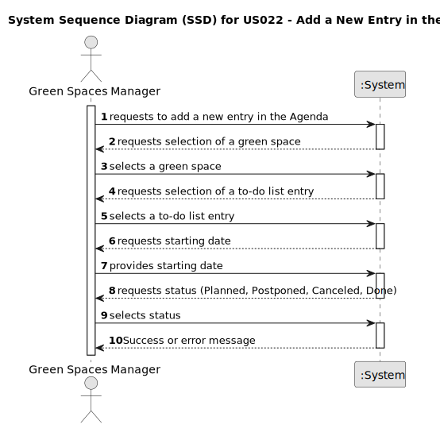

# US022 - Add a new entry in the agenda

## 1. Requirements Engineering

### 1.1. User Story Description

As a GSM, I want to add a new entry in the Agenda.

### 1.2. Customer Specifications and Clarifications 

**From the specifications document:**

>	• Green Spaces Manager (GSM) - the person responsible for managing
the green spaces in charge of the organization
> 
> • The Agenda is a crucial mechanism for planning the week’s work. Each entry
in the Agenda defines a task (that was previously included in the to-do list).
A team will carry out that task in a green space at a certain time interval
on a specific date. Comparatively analyzing the Agenda entries and the
pending tasks (to-do list) allows you to evaluate the work still to be done,
the busyness of the week, and the work performed by a team in a green space
at a determined time interval and on a specific date.

**From the client clarifications:**

> **Question:**
> When a to-do list entry is added to the agenda, what should its state be?

> **Answer:**
Maybe "planned".

> **Question:**
Is it mandatory for the program to have multiple GSM? If so, should each green space be associated with a responsible GSM? In other words, can only the GSM assigned to a specific green space register a new entry for the to-do list?

> **Answer:**
The program can have multiple GSM.
Yes.
Yes.
>

> **Question:**
When it comes to To-Do List entries, we identified a state (planned, postponed, completed, canceled), a green space, a title, and a description as inputs for a To-Do List entry. But are there any more?
> 

> **Answer:**
In the text you can find: the degree of urgency (High, Medium,and Low), and the approximate expected duration.
>

> **Question:**
We also know that an Agenda entry has a target date, but is this target date supposed to be inputted upon transferring a task from the to-do list to the agenda, or is it supposed to be inputted upon creating the task in the to-do list?

> **Answer:**
To-do list entries doesn't have dates!

> **Question:**
Finally, during the last client meeting, we became aware that some tasks are meant to be reoccurring rather than occasional. Is this something that should be asked on creating the task in the to-do list? If so, what inputs should we expect from the user? The task's frequency in days?

> **Answer:**
For the current proof-of-concept there is no need to distinguish between recurring and occasional tasks.

### 1.3. Acceptance Criteria

 **AC1:** All required fields must be filled in.

 **AC2:** As a GSM i should be able to add a new entry in the agenda.

 **AC3:** ---

### 1.4. Found out Dependencies

--

### 1.5 Input and Output Data

**Input Data:**
     --

**Output Data:**
--

### 1.6. System Sequence Diagram (SSD)

