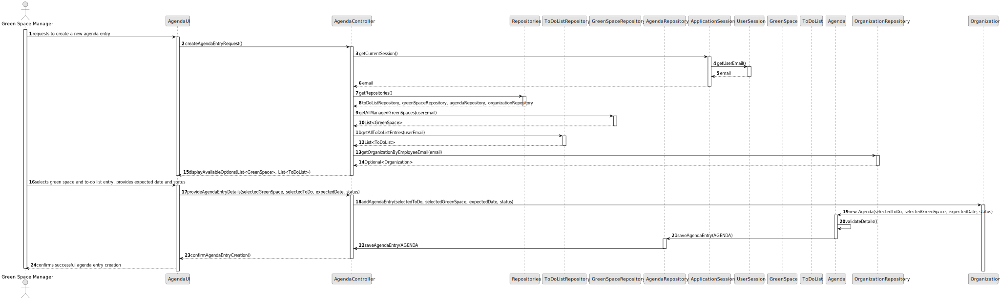
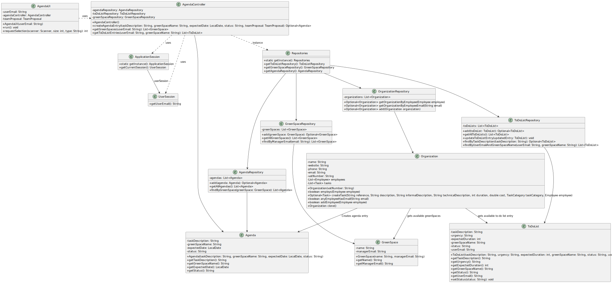

# US002 - Create a new job

## 3. Design - User Story Realization 

### 3.1. Rationale

| Interaction ID                                            | Question: Which class is responsible for...                    | Answer           | Justification (with patterns)                                                                                 |
|:----------------------------------------------------------|:---------------------------------------------------------------|:-----------------|:--------------------------------------------------------------------------------------------------------------|
| Step 1  		                                                | 	... interacting with the actor?                               | AgendaUI         | Pure Fabrication: there is no reason to assign this responsibility to any existing class in the Domain Model. |
| Step 2                                                    | 	... displaying the form for the actor to input the data						 | AgendaUI         | IE: is responsible for user interactions.                                                                     |
| Step 3                                                    | 	... displaying the available greenspaces					                 |                  | IE: is responsible for user interactions.                                                                     |
| Step 4                                                    | 	... displaying the available to-do list entries				           |                  | IE: is responsible for user interactions.                                                                     |
| Step 5	                                                   | 	... requesting expectedDate			                                |                  | IE: is responsible for user interactions.                                                                     |
| 	Step 6	                                                  | 	... requesting status				                                     |                  | IE: is responsible for user interactions.                                                                     |
| Step 7 - Types requested data                             | 	... temporarily keeping the inputted data                     | AgendaUI         | IE: is responsible for temporarily keeping the typed data until the actor confirms it                         |
| Step 8 - Shows all data and requests confirmation	        | 	... displaying all information before submitting              | AgendaUI         | IE: Temporarily shows inputted that until actor confirms it                                                   |
| Step 9 - Validating details and creating agenda object?		 | 	... Agenda?                                                   | Agenda           | Creator: Agenda is responsible for creating the appropriate agenda object based on the provided details.      | | 
| Step 10 - Display operation success                       | 	... informing operation success?                              | AgendaController | IE: is responsible for user interactions.                                                                     |  
|           | 	... saving typed data                                         | AgendaRepository | Repository: Handles storage and retrieval of agenda entries, ensuring data integrity and persistence.                                                                |  

### Systematization ##

According to the taken rationale, the conceptual classes promoted to software classes are: 

* Agenda
* AgendaRepository

Other software classes (i.e. Pure Fabrication) identified: 

* AgendaUI  

## 3.2. Sequence Diagram (SD)

_**Note that SSD - Alternative Two is adopted.**_

### Full Diagram

This diagram shows the full sequence of interactions between the classes involved in the realization of this user story.

[//]: # (### Split Diagrams)

[//]: # ()
[//]: # (The following diagram shows the same sequence of interactions between the classes involved in the realization of this user story, but it is split in partial diagrams to better illustrate the interactions between the classes.)

[//]: # ()
[//]: # (It uses Interaction Occurrence &#40;a.k.a. Interaction Use&#41;.)

[//]: # ()
[//]: # (![Sequence Diagram - split]&#40;svg/us006-sequence-diagram-split.svg&#41;)

[//]: # ()
[//]: # (**Get Task Category List Partial SD**)

[//]: # ()
[//]: # (![Sequence Diagram - Partial - Get Task Category List]&#40;svg/us006-sequence-diagram-partial-get-task-category-list.svg&#41;)

[//]: # ()
[//]: # (**Get Task Category Object**)

[//]: # ()
[//]: # (![Sequence Diagram - Partial - Get Task Category Object]&#40;svg/us006-sequence-diagram-partial-get-task-category.svg&#41;)

[//]: # ()
[//]: # (**Get Employee**)

[//]: # ()
[//]: # (![Sequence Diagram - Partial - Get Employee]&#40;svg/us006-sequence-diagram-partial-get-employee.svg&#41;)

[//]: # ()
[//]: # (**Create Task**)

[//]: # ()
[//]: # (![Sequence Diagram - Partial - Create Task]&#40;svg/us006-sequence-diagram-partial-create-task.svg&#41;)

## 3.3. Class Diagram (CD)

