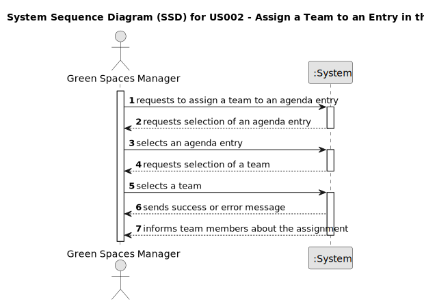

# US002 - Assign a team to entry in Agenda

## 1. Requirements Engineering

### 1.1. User Story Description

As a GSM, I want to assign a Team to an entry in the Agenda.

### 1.2. Customer Specifications and Clarifications 

**From the specifications document:**

>	• Green Spaces Manager (GSM) - the person responsible for managing
the green spaces in charge of the organization
>
> • The Agenda is a crucial mechanism for planning the week’s work. Each entry
in the Agenda defines a task (that was previously included in the to-do list).
A team will carry out that task in a green space at a certain time interval
on a specific date. Comparatively analyzing the Agenda entries and the
pending tasks (to-do list) allows you to evaluate the work still to be done,
the busyness of the week, and the work performed by a team in a green space
at a determined time interval and on a specific date.
>
> The Agenda is made
up of entries that relate to a task (which was previously in the To-Do List),
the team that will carry out the task, the vehicles/equipment assigned to
the task, expected duration, and the status (Planned, Postponed, Canceled,
Done).

**From the client clarifications:**

> **Question:**
> "Can an Agenda entry have more than one team assigned to it?"

> **Answer:** 
"
No."

> **Question:** 
 "Can a Team be assigned to multiple entrys?"

> **Answer:**
"Yes
"

### 1.3. Acceptance Criteria

 **AC1:**  A message must be sent to all team members informing
 them about the assignment.

 **AC2:** : Different email services can send the message. These services must be defined through a configuration file to allow the use
 of different platforms (e.g. Gmail, DEI’s email service, etc.).

### 1.4. Found out Dependencies

US022 and US005 Because we have to have the agenda and the team created.

### 1.5 Input and Output Data

**Selected Data:**
* Select agenda entry
* Select team available for that entry

**Output Data:**
(In)Success of the operation

### 1.6. System Sequence Diagram (SSD)

