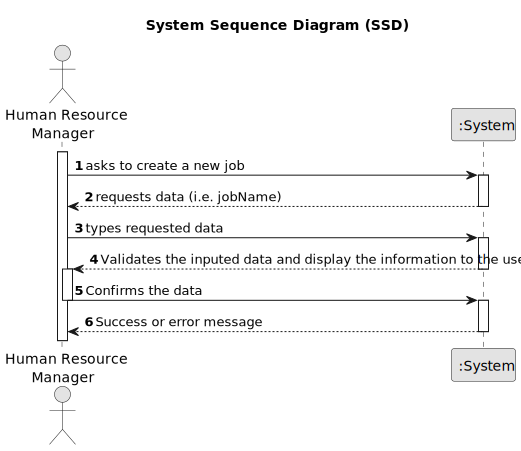

# US002 - Register a job

## 1. Requirements Engineering

### 1.1. User Story Description

As an user resources manager, I want to register new jobs.

### 1.2. Customer Specifications and Clarifications 

**From the specifications document:**

>	MS has a wide range of employees who carry out the most varied tasks in the context
    of managing green spaces. Some job examples are designer, estimator, gardener, electrician or bricklayer

**From the client clarifications:**

> **Question:**
> "Bom dia, Para a US02, gostaria de esclarecer o seguinte:
É relevante associar uma área ou setor específico a cada Job? (Por exemplo, "Jardineiro" seria inserido no setor de "Manutenção")
Deve-se incluir informações como salário, tipo de contratação (full-time ou part-time), e modalidade de trabalho (presencial, remoto ou híbrido) no Job? Ou essas informações encaixam-se melhor no âmbito do colaborador, ou talvez nem sejam necessárias?
Que outras informações acha necessárias associar ao Job?
Agradeço a atenção dispensada."

> **Answer:** 
"Bom dia,
 não é necessário na medida que não existem US que sugiram que isso possa vir a ser necessário;
 idem;
 para já nenhumas;
> De nada."

> **Question:** 
 "Quais são os dados de entrada para a criação de uma profissão?"

> **Answer:**
"o Nome da profissão:
jardineiro
calceteiro
electricista
condutor
...
"

### 1.3. Acceptance Criteria

 **AC1:** All required fields must be filled in.
 **AC2:** As a HRM i should be able to create a new job
 **AC3:** When creating a job that already exist, the system must reject such operation.

### 1.4. Found out Dependencies

No found out dependencies

### 1.5 Input and Output Data

**Input Data:**
     jobName

**Output Data:**
(In)Success of the operation

### 1.6. System Sequence Diagram (SSD)

