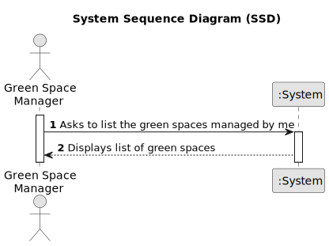

# US027 - List all green spaces managed by me

## 1. Requirements Engineering

### 1.1. User Story Description

As a GSM, I need to list all green spaces managed by me.

### 1.2. Customer Specifications and Clarifications 

**From the specifications document:**

>	The list of green spaces must be sorted by size in descending order. The sorting algorithm to be used by the application
must be defined through a configuration file. At least two sorting
algorithms should be available.

**From the client clarifications:**

> **Question:**
> "Dear client, in this user story you only want to list the Green Spaces manage by the GSM. Due to this, the GSM should be register in the app previusly, isn't it? Which atributes should it have? A  GSM is a collaborator?"

> **Answer:** 
"yes; the GSM (you can have many) should be registered in the app.
GSM is a role that can be played a registered user with the appropriate priviliges;"

> **Question:** 
 "Dear client, which info about Green Spaces do you want the GSM see when listing? only the name ?"

> **Answer:**
"Each de team can decide about the aspects related to UX/UI.
"

### 1.3. Acceptance Criteria

* **AC1:** The list of green spaces must be sorted by size in descending order.
* **AC2:** The sorting algorithm to be used by the application must be defined through a configuration file.
* **AC3:** At least two sorting algorithms should be available.
* **AC4:** The system should determine which green spaces are assigned to the logged GSM and list them. 

### 1.4. Found out Dependencies

There is a dependency in US20 as if there isn't Green Spaces a list can't be made.

### 1.5 Input and Output Data

**Output Data:**
List of the managed Green Spaces and their data.

### 1.6. System Sequence Diagram (SSD)

