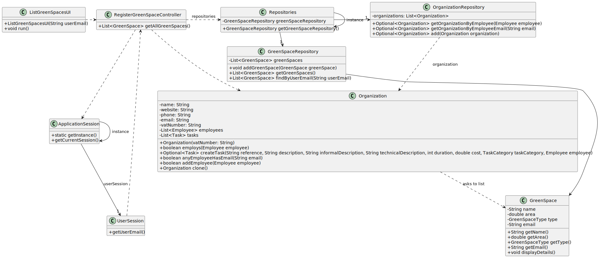

# US027 - List all green spaces managed by me

## 3. Design - User Story Realization 

### 3.1. Rationale

| Interaction ID                                      | Question: Which class is responsible for...                        | Answer                       | Justification (with patterns)                                                                                      |
|:----------------------------------------------------|:------------------------------------------------------------------|:-----------------------------|:-------------------------------------------------------------------------------------------------------------------|
| Step 1                                              | ... starting the use case?                                         | ListGreenSpacesUI            | Pure Fabrication: Responsible for starting the UI interaction for the GSM.                                          |
| Step 2 - Retrieving current session                 | ... retrieving the current user session?                           | ApplicationSession           | IE: Manages the user session, providing access to the current session.                                              |
| Step 3 - Fetching user email                        | ... getting the user email from the session?                       | UserSession                  | IE: Provides the user email for the current session.                                                                |
| Step 4 - Fetching green spaces                      | ... retrieving the green spaces managed by the user?                | RegisterGreenSpaceController | Controller: Coordinates the process of fetching green spaces.                                                      |
|                                                     | ... accessing the repository for green spaces?                     | RegisterGreenSpaceController | Controller: Interacts with the repository to fetch the required data.                                               |
| Step 5 - Fetching repository instance               | ... getting the instance of the repository?                        | Repositories                 | IE: Manages access to different repositories.                                                                      |
| Step 6 - Fetching green spaces by user email        | ... filtering green spaces by user email?                          | GreenSpaceRepository         | IE: Knows all green spaces and can filter them based on user email.                                                 |
| Step 7 - Sorting green spaces                       | ... reading the sorting algorithm configuration?                   | ConfigReader                 | IE: Reads the configuration for sorting algorithm.                                                                 |
|                                                     | ... sorting the green spaces?                                      | GreenSpaceSorter             | IE: Defines the sorting mechanism for green spaces.                                                                |
| Step 8 - Returning the sorted list                  | ... returning the sorted list of green spaces?                     | RegisterGreenSpaceController | Controller: Coordinates the process and returns the final sorted list.                                              |
| Step 9 - Displaying the sorted green spaces         | ... displaying the sorted list of green spaces to the user?        | ListGreenSpacesUI                        | IE: Responsible for displaying the final sorted list to the user.                                                   |

### Systematization

According to the taken rationale, the conceptual classes promoted to software classes are:

* GreenSpace
* GreenSpaceRepository

Other software classes (i.e., Pure Fabrication) identified:

* ListGreenSpacesUI
* RegisterGreenSpaceController
* ConfigReader
* GreenSpaceSorter
* Repositories
* ApplicationSession
* UserSession

## 3.2. Sequence Diagram (SD)

_**Note that SSD - Alternative Two is adopted.**_

### Full Diagram

This diagram shows the full sequence of interactions between the classes involved in the realization of this user story.

### Split Diagrams

The following diagram shows the same sequence of interactions between the classes involved in the realization of this user story, but it is split in partial diagrams to better illustrate the interactions between the classes.

It uses Interaction Occurrence; a.k.a. Interaction Use

;

**Retrieve all green spaces**

**Read sorting algorithm**

**Sort green spaces**

## 3.3. Class Diagram (CD)

