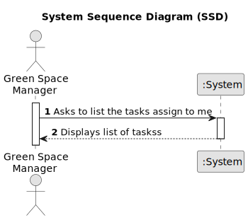

# US028 - Consult the tasks assigned to me between two dates.

## 1. Requirements Engineering

### 1.1. User Story Description

As a Collaborator, I wish to consult the tasks assigned to me between two dates.

### 1.2. Customer Specifications and Clarifications 

**From the specifications document:**

>	The list of tasks spaces must be sorted by date and the Collaborator should be able to filter the results by the
status of the task.

**From the client clarifications:**

> **Question:**
> "When a collaborator is registered, they are given an account with the registered email and a password? This allows them to log in and view their tasks later on. What should be the password for this collaborator's account?"

> **Answer:** 
"
Yes, it make sense.
About the password, not important in this stage of the project."

> **Question:** 
 "In the US28, the tasks consulted will be the ones that were assigned to the team/teams that collaborator is in, right?
Why do we need to show a list of green spaces? Are we assuming that one collaborator could work in 2 different parks?
What should be the output? The description of the task + the team (if the first sentence is correct)?
Thank you."

> **Answer:**
"1) right"
"2) Yes, a collaborator can work in multiples green spaces"
"3) Development teams can decide about the UX/UI related aspects of the solution."
"

### 1.3. Acceptance Criteria

 **AC1:** The list of tasks spaces must be sorted by date.
 **AC2:** The Collaborator should be able to filter the results by the status of the task.

### 1.4. Found out Dependencies

There's a dependency in US22, as if I don't have entries in the Agenda I can't consult the tasks.
There's a dependency in US23, as if I don't have entries assigned to a team I can't receive them in the email.

### 1.5 Input and Output Data

**Output Data:**
List of the tasks assigned to me.

### 1.6. System Sequence Diagram (SSD)

