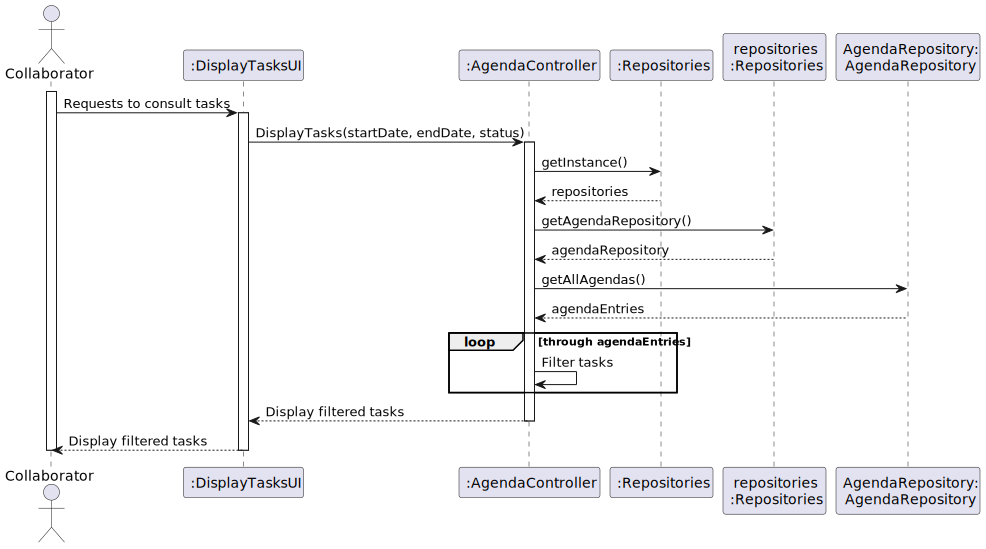
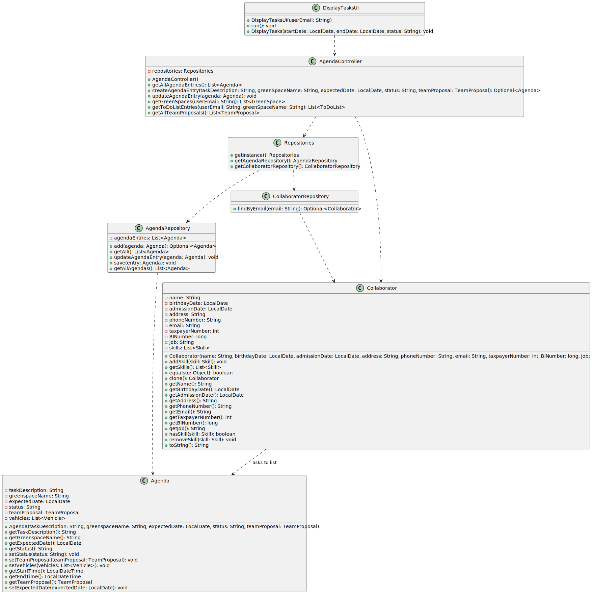

# US028 - Consult the tasks assigned to me between two dates.

## 3. Design - User Story Realization 

### 3.1. Rationale

| Interaction ID                                              | Question: Which class is responsible for...                    | Answer               | Justification (with patterns)                                                                                      |
|:------------------------------------------------------------|:---------------------------------------------------------------|:---------------------|:-------------------------------------------------------------------------------------------------------------------|
| Step 1  		                                                  | 	... interacting with the actor?                               | ConsultTasksUI       | Pure Fabrication: there is no reason to assign this responsibility to any existing class in the Domain Model.      |
| Step 2 - Requests data  (startDate, endDate, status) 	      | 	... displaying the form for the actor to input the data		 | ConsultTasksUI       | IE: responsible for user interactions.                                                                            |
| Step 3 - Inputs requested data (startDate, endDate, status) | 	... temporarily keeping the inputted data                      | ConsultTasksUI       | IE: responsible for temporarily keeping the typed data until the actor confirms it.                               |
| Step 4 - Shows all data and requests confirmation	          | 	... displaying all information before submitting              | ConsultTasksUI       | IE: temporarily shows inputted data until actor confirms it.                                                       |
| Step 5 - Confirm data		                                     | 	... filtering tasks?                                          | ConsultTasksController| IE: responsible for coordinating the task consultation process, interacts with both UI and repositories.        |
| 		                                                          | 			... sorting tasks by date?				                     | Task                  | IE: the task entity owns its date data.                                                                          |              
| 		                                                          | 	... filtering tasks by status?                                | Task                  | IE: the task entity owns its status data.                                                                        | 
| 			  		                                                     | 	... retrieving tasks between two dates?                      | TaskRepository        | IE: responsible for accessing and managing task data.                                                            | 
| 			  		                                                     | 	... presenting the retrieved tasks?                           | ConsultTasksUI        | IE: responsible for presenting the tasks to the user.                                                            | 
| Step 6 - Display operation success                          | 	... informing operation success?                              | ConsultTasksUI       | IE: responsible for user interactions.                                                                            |  

### Systematization ##

According to the taken rationale, the conceptual classes promoted to software classes are: 

* Job

Other software classes (i.e. Pure Fabrication) identified: 

* CreateJobUI  
* CreateJobController

## 3.2. Sequence Diagram (SD)

_**Note that SSD - Alternative Two is adopted.**_

### Full Diagram

This diagram shows the full sequence of interactions between the classes involved in the realization of this user story.

## 3.3. Class Diagram (CD)

